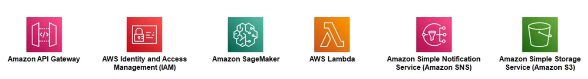

# AWS Stock Price Predictor Project

## Overview

This project integrates AWS SageMaker, AWS Lambda, Amazon SNS, and Amazon API Gateway to create a robust machine learning pipeline. It demonstrates the end-to-end process of building, training, and deploying a machine learning model using Amazon SageMaker. The system utilizes AWS Lambda for serverless execution of model inference, Amazon SNS for alert notifications, and Amazon API Gateway as the interface for RESTful API interactions.

## Architecture

The solution architecture includes:
- **Amazon SageMaker**: For model notebook management, training, and deployment.
- **AWS Lambda**: To process requests and perform model inference.
- **Amazon API Gateway**: To handle REST API requests.
- **Amazon SNS**: For sending email notifications based on Lambda triggers.

## Getting Started

### Prerequisites

- AWS account
- AWS CLI installed and configured
- Python 3.x

### Setup

1. **Amazon SageMaker**:
- Deploy your model in SageMaker and note the endpoint.

2. **AWS Lambda**:
- Create a Lambda function that can call the SageMaker endpoint for inferences.

3. **Amazon API Gateway**:
- Setup an API Gateway to trigger the Lambda function.

4. **Amazon SNS**:
- Configure SNS to send notifications upon specific events or Lambda triggers.

